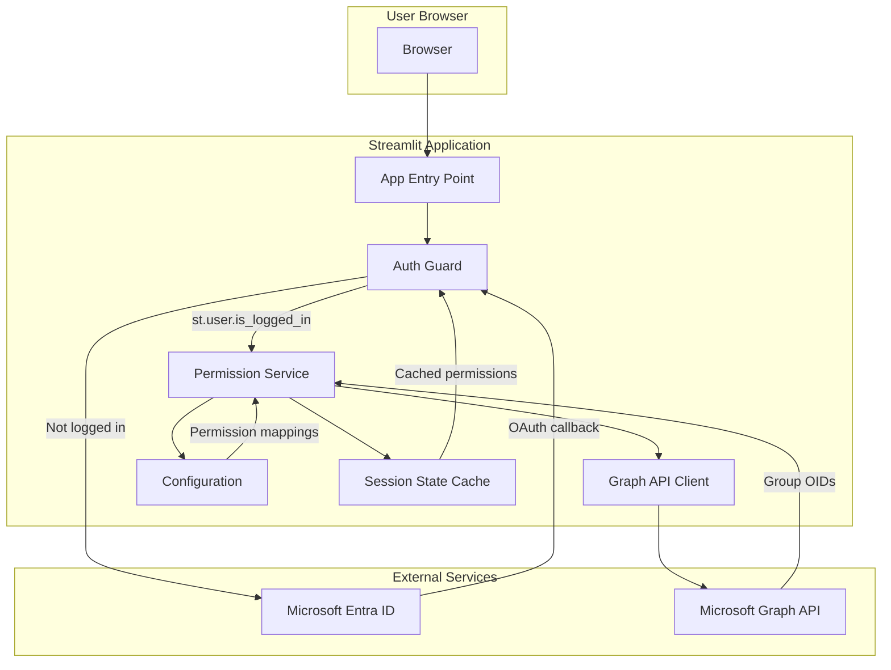

# Design Document: Entra ID Authentication

## Overview

This design document describes the implementation of Microsoft Entra ID authentication for the FinOps AI Dashboard Streamlit application. The solution leverages Streamlit's native OIDC authentication features (`st.login`, `st.logout`, `st.user`) combined with Microsoft Graph API for group membership retrieval and a custom permission mapping system.

The architecture follows a layered approach:
1. **Configuration Layer** - Manages secrets and permission mappings
2. **Authentication Layer** - Handles Streamlit's native OIDC flow
3. **Authorization Layer** - Maps Entra ID groups to application permissions
4. **Session Layer** - Caches user permissions in session state

## Architecture



## Components and Interfaces

### 1. Configuration Module (`src/auth/config.py`)

Manages authentication configuration loaded from Streamlit secrets.

```python
from dataclasses import dataclass
from typing import Dict, Optional
from enum import IntEnum

class PermissionLevel(IntEnum):
    """Application permission levels ordered by privilege."""
    VIEWER = 1
    ANALYST = 2
    ADMIN = 3

@dataclass
class AuthConfig:
    """Authentication configuration from secrets.toml."""
    client_id: str
    client_secret: str
    tenant_id: str
    redirect_uri: str
    cookie_secret: str
    server_metadata_url: str
    group_mappings: Dict[str, PermissionLevel]  # OID -> PermissionLevel
    
    @classmethod
    def from_secrets(cls, secrets: dict) -> 'AuthConfig':
        """Load configuration from Streamlit secrets."""
        pass
    
    def validate(self) -> None:
        """Validate all required configuration is present."""
        pass

def load_auth_config() -> AuthConfig:
    """Load and validate authentication configuration."""
    pass

def build_metadata_url(tenant_id: str) -> str:
    """Build the OIDC metadata URL for a tenant."""
    pass
```

### 2. User Claims Module (`src/auth/claims.py`)

Extracts and validates user claims from `st.user`.

```python
from dataclasses import dataclass
from typing import Optional
from datetime import datetime

@dataclass
class UserClaims:
    """User identity claims from Entra ID."""
    oid: str  # User Object ID
    email: str
    name: str
    preferred_username: str
    tenant_id: str
    exp: Optional[int] = None  # Token expiration timestamp
    
    @classmethod
    def from_st_user(cls, st_user: dict) -> 'UserClaims':
        """Extract claims from st.user dict."""
        pass
    
    def is_expired(self) -> bool:
        """Check if the token has expired."""
        pass

def extract_user_claims() -> Optional[UserClaims]:
    """Extract claims from st.user if logged in."""
    pass

def check_login_status() -> bool:
    """Verify user is logged in before accessing claims."""
    pass
```

### 3. Graph API Client (`src/auth/graph_client.py`)

Retrieves group memberships from Microsoft Graph API.

```python
from typing import List
import httpx

class GraphAPIClient:
    """Client for Microsoft Graph API."""
    
    GRAPH_BASE_URL = "https://graph.microsoft.com/v1.0"
    
    def __init__(self, client_id: str, client_secret: str, tenant_id: str):
        self.client_id = client_id
        self.client_secret = client_secret
        self.tenant_id = tenant_id
        self._access_token: Optional[str] = None
    
    async def get_user_groups(self, user_oid: str) -> List[str]:
        """Get group OIDs for a user."""
        pass
    
    async def _get_access_token(self) -> str:
        """Get access token using client credentials flow."""
        pass
```

### 4. Permission Service (`src/auth/permissions.py`)

Maps group OIDs to permission levels and manages permission caching.

```python
from typing import List, Optional
from src.auth.config import PermissionLevel, AuthConfig

@dataclass
class UserPermission:
    """User permission data for session storage."""
    user_oid: str
    permission_level: PermissionLevel
    group_oids: List[str]
    
    def to_dict(self) -> dict:
        """Serialize for session storage."""
        pass
    
    @classmethod
    def from_dict(cls, data: dict) -> 'UserPermission':
        """Deserialize from session storage."""
        pass

class PermissionService:
    """Service for managing user permissions."""
    
    def __init__(self, config: AuthConfig, graph_client: GraphAPIClient):
        self.config = config
        self.graph_client = graph_client
    
    def map_groups_to_permission(self, group_oids: List[str]) -> PermissionLevel:
        """Map group OIDs to highest permission level."""
        pass
    
    def resolve_highest_permission(self, levels: List[PermissionLevel]) -> PermissionLevel:
        """Return the highest permission level from a list."""
        pass
    
    async def determine_user_permission(self, user_oid: str) -> UserPermission:
        """Determine user's permission level from their groups."""
        pass
    
    def cache_permission(self, permission: UserPermission) -> None:
        """Cache permission in session state."""
        pass
    
    def get_cached_permission(self) -> Optional[UserPermission]:
        """Get cached permission from session state."""
        pass

def has_permission(required: PermissionLevel) -> bool:
    """Check if current user has required permission level."""
    pass

def get_current_permission() -> Optional[PermissionLevel]:
    """Get current user's permission level."""
    pass
```

### 5. Auth Guard (`src/auth/guard.py`)

Main authentication flow controller.

```python
import streamlit as st
from src.auth.config import load_auth_config
from src.auth.claims import extract_user_claims, check_login_status
from src.auth.permissions import PermissionService, has_permission
from src.auth.logging import log_auth_event, log_logout, log_access_denied

class AuthGuard:
    """Guards application access with Entra ID authentication."""
    
    def __init__(self):
        self.config = load_auth_config()
        self.permission_service = PermissionService(...)
    
    def require_auth(self) -> bool:
        """Require authentication, show login if not authenticated."""
        pass
    
    def require_permission(self, level: PermissionLevel) -> bool:
        """Require specific permission level."""
        pass
    
    def login(self) -> None:
        """Initiate login flow."""
        st.login()
    
    def logout(self) -> None:
        """Logout and clear session."""
        st.logout()
    
    def render_login_page(self) -> None:
        """Render the login interface."""
        pass
    
    def render_access_denied(self, required: PermissionLevel) -> None:
        """Render access denied message."""
        pass
```

### 6. Audit Logging (`src/auth/logging.py`)

Handles security event logging.

```python
import logging
from datetime import datetime
from src.auth.config import PermissionLevel

logger = logging.getLogger("auth")

def log_auth_event(email: str, oid: str, permission: PermissionLevel) -> None:
    """Log successful authentication."""
    pass

def log_auth_failure(reason: str) -> None:
    """Log authentication failure without sensitive details."""
    pass

def log_logout(email: str) -> None:
    """Log user logout."""
    pass

def log_access_denied(user_oid: str, resource: str, required: PermissionLevel) -> None:
    """Log access denial."""
    pass
```

## Data Models

### secrets.toml Configuration

```toml
[auth]
redirect_uri = "http://localhost:8501/oauth2callback"
cookie_secret = "your-strong-random-secret"
client_id = "your-entra-app-client-id"
client_secret = "your-entra-app-client-secret"
server_metadata_url = "https://login.microsoftonline.com/{tenant_id}/v2.0/.well-known/openid-configuration"

[auth.group_mappings]
# Map Entra ID group OIDs to permission levels
"oid-of-admin-group" = "admin"
"oid-of-analyst-group" = "analyst"
"oid-of-viewer-group" = "viewer"
```

### Session State Schema

```python
# st.session_state keys
SESSION_PERMISSION_KEY = "user_permission"

# Stored as dict:
{
    "user_oid": "user-guid",
    "permission_level": 3,  # PermissionLevel.ADMIN
    "group_oids": ["group-oid-1", "group-oid-2"]
}
```

### st.user Claims (from Entra ID)

```python
{
    "is_logged_in": True,
    "ver": "2.0",
    "iss": "https://login.microsoftonline.com/{tenant_id}/v2.0",
    "sub": "{application_user_id}",
    "aud": "{application_id}",
    "exp": 1234567890,
    "iat": 1234567800,
    "nbf": 1234567800,
    "name": "John Doe",
    "preferred_username": "john.doe@company.com",
    "oid": "{user_guid}",
    "email": "john.doe@company.com",
    "tid": "{tenant_id}"
}
```

## Correctness Properties

*A property is a characteristic or behavior that should hold true across all valid executions of a system-essentially, a formal statement about what the system should do. Properties serve as the bridge between human-readable specifications and machine-verifiable correctness guarantees.*

Based on the prework analysis, the following correctness properties have been identified:

### Property 1: Configuration Loading Completeness
*For any* valid secrets.toml configuration containing all required fields (client_id, client_secret, redirect_uri, cookie_secret, server_metadata_url), loading the configuration SHALL produce an AuthConfig object with all fields populated correctly.
**Validates: Requirements 1.1**

### Property 2: Missing Configuration Detection
*For any* secrets.toml configuration missing one or more required fields, the configuration validation SHALL raise a descriptive error identifying the missing field(s).
**Validates: Requirements 1.2**

### Property 3: Metadata URL Format
*For any* valid tenant ID (GUID format), the `build_metadata_url` function SHALL produce a URL matching the pattern `https://login.microsoftonline.com/{tenant_id}/v2.0/.well-known/openid-configuration`.
**Validates: Requirements 1.3**

### Property 4: Group Mapping Storage
*For any* group-to-permission mapping configuration, the loaded AuthConfig SHALL contain a `group_mappings` dict where each key is a group OID string and each value is a valid PermissionLevel.
**Validates: Requirements 1.4**

### Property 5: User Claims Extraction
*For any* st.user dict containing oid, email, name, preferred_username, and tid fields, the `UserClaims.from_st_user` function SHALL extract all fields into a UserClaims object with matching values.
**Validates: Requirements 2.3, 3.1**

### Property 6: Login Status Verification
*For any* st.user dict where `is_logged_in` is False, calling `extract_user_claims` SHALL return None without attempting to access other claims.
**Validates: Requirements 3.2**

### Property 7: Token Expiration Check
*For any* UserClaims object with an `exp` timestamp, the `is_expired` method SHALL return True if the current time is greater than or equal to `exp`, and False otherwise.
**Validates: Requirements 3.4**

### Property 8: Permission Data Round-Trip
*For any* valid UserPermission object, serializing with `to_dict()` and then deserializing with `from_dict()` SHALL produce an equivalent UserPermission object.
**Validates: Requirements 3.5, 3.6**

### Property 9: Group to Permission Mapping
*For any* list of group OIDs and any group mapping configuration, the `map_groups_to_permission` function SHALL return the highest PermissionLevel among all matched groups, or VIEWER if no groups match.
**Validates: Requirements 4.2, 4.3, 4.4**

### Property 10: Highest Permission Resolution
*For any* non-empty list of PermissionLevel values, `resolve_highest_permission` SHALL return the maximum value. For an empty list, it SHALL return PermissionLevel.VIEWER.
**Validates: Requirements 4.3**

### Property 11: Permission Caching
*For any* UserPermission object, after calling `cache_permission`, calling `get_cached_permission` SHALL return an equivalent UserPermission object.
**Validates: Requirements 5.5, 6.1**

### Property 12: Permission Level Check
*For any* cached permission level P and required permission level R, `has_permission(R)` SHALL return True if P >= R, and False otherwise.
**Validates: Requirements 6.2**

### Property 13: Auth Event Log Content
*For any* successful authentication event, the log entry SHALL contain the user's email, OID, timestamp, and assigned permission level.
**Validates: Requirements 7.1**

### Property 14: Log Sanitization
*For any* authentication failure log entry, the log content SHALL NOT contain passwords, tokens, or client secrets.
**Validates: Requirements 7.2**

### Property 15: Logout Log Content
*For any* logout event, the log entry SHALL contain the user's email and a timestamp.
**Validates: Requirements 7.3**

### Property 16: Access Denied Log Content
*For any* access denial event, the log entry SHALL contain the user's OID, the requested resource identifier, and the required permission level.
**Validates: Requirements 7.4**

## Error Handling

### Configuration Errors
- Missing required secrets: Raise `ConfigurationError` with specific field name
- Invalid tenant ID format: Raise `ConfigurationError` with format guidance
- Invalid permission level in mapping: Raise `ConfigurationError` listing valid levels

### Authentication Errors
- Token expired: Call `st.logout()` and redirect to login
- Claims extraction failure: Log error, show generic "Authentication failed" message
- Graph API failure: Log error, assign default VIEWER permission, continue

### Authorization Errors
- Insufficient permissions: Display access denied message with required level
- Session state corruption: Clear session, require re-authentication

## Testing Strategy

### Unit Testing
Unit tests will verify individual component behavior:
- Configuration parsing and validation
- User claims extraction
- Permission mapping logic
- Session state serialization/deserialization
- Log message formatting

### Property-Based Testing
Property-based tests will use **Hypothesis** (Python's PBT library) to verify correctness properties:

1. **Configuration Properties (1-4)**: Generate random valid/invalid configurations and verify loading behavior
2. **Claims Properties (5-7)**: Generate random user claim dicts and verify extraction/validation
3. **Permission Properties (8-12)**: Generate random permission data and verify mapping/caching/checking
4. **Logging Properties (13-16)**: Generate random auth events and verify log content

Each property-based test will:
- Run a minimum of 100 iterations
- Be tagged with the format: `**Feature: entraid-authentication, Property {number}: {property_text}**`
- Reference the specific correctness property being validated

### Integration Testing
Integration tests will verify:
- End-to-end authentication flow with mock Entra ID
- Graph API client with mock responses
- Session persistence across page reloads

### Test Configuration
```python
# conftest.py
from hypothesis import settings

settings.register_profile("ci", max_examples=100)
settings.load_profile("ci")
```
