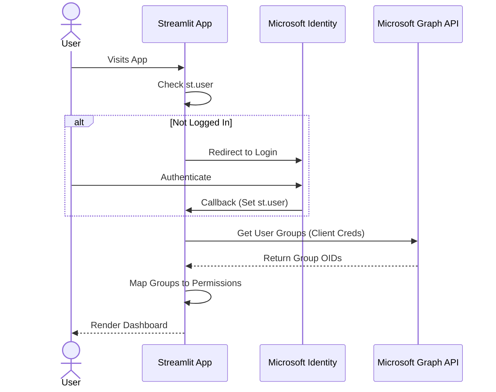
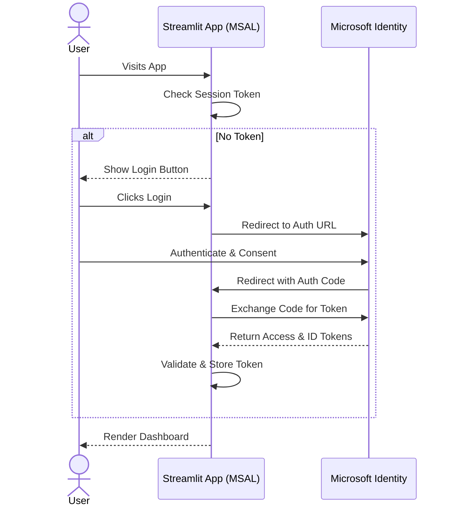

# Authentication & Authorization

This document outlines the authentication and authorization mechanisms used in the Streamlit User Management System.

## Overview

The application uses **Microsoft Entra ID (formerly Azure AD)** for authentication. It supports two modes:
1.  **Streamlit Native Auth (Default)**: Uses Streamlit's built-in OIDC integration.
2.  **MSAL Auth (Optional)**: Uses the Microsoft Authentication Library (MSAL) for Python for more control over the token flow.

Authorization is Role-Based (RBAC), mapping Entra ID Groups to application permissions.

## 1. Streamlit Native Authentication (Default)

This flow relies on Streamlit's native integration with identity providers.

### Configuration
Configured in `.streamlit/secrets.toml`:
```toml
[auth]
redirect_uri = "http://localhost:8501/oauth2callback"
cookie_secret = "..."
client_id = "..."
client_secret = "..."
server_metadata_url = "https://login.microsoftonline.com/{tenant_id}/v2.0/.well-known/openid-configuration"
```

### Flow
1.  **User Access**: User visits the app.
2.  **Auth Check**: `AuthGuard` checks `st.user` (populated by Streamlit after successful login).
3.  **Redirect**: If not logged in, `st.login()` redirects to Microsoft Login.
4.  **Callback**: Microsoft redirects back to the app.
5.  **Session**: Streamlit sets the user session in `st.user`.
6.  **Permission Sync**:
    -   `AuthGuard` extracts the user's Object ID (OID) from `st.user`.
    -   It calls Microsoft Graph API (using Client Credentials) to fetch the user's group memberships.
    -   Groups are mapped to permissions (`VIEWER`, `ANALYST`, `ADMIN`) based on `secrets.toml`.



### User Feedback Enhancements

To improve the user experience during the authentication process, the following feedback mechanisms have been implemented in `src/auth/guard.py`:

-   **Login Redirection Toast**: When the user initiates a login, a toast message "Redirecting to Microsoft Login..." appears, providing immediate feedback before the browser redirection.
-   **Login Page Information**: The login page (`render_login_page`) now includes an `st.info` message explaining the necessity of signing in for accessing sensitive financial data.
-   **Logout Confirmation**: A toast message "Logging out..." confirms the user's logout action.
-   **Enhanced Access Denied**: The `render_access_denied` message has been made more user-friendly and actionable, clearly stating the required permission level and providing guidance on how to check current roles and request access.

## 2. MSAL Authentication (Optional)

This flow uses `msal` to handle the OAuth2 Authorization Code Flow manually. This is useful if you need more control over tokens or if Streamlit's native auth is insufficient (e.g., for complex claim handling).

### Usage
To use this, replace `AuthGuard` with `MSALAuthGuard` in `streamlit_main.py`.

### Flow
1.  **User Access**: User visits the app.
2.  **Auth Check**: `MSALAuthGuard` checks `st.session_state` for a valid token.
3.  **Login URL**: If not logged in, it generates a login URL using `msal.ConfidentialClientApplication.get_authorization_request_url`.
4.  **Redirect**: User clicks "Login" and is redirected to Microsoft.
5.  **Callback**:
    -   Microsoft redirects to the app with an authorization `code`.
    -   App captures the code (via query params).
    -   `MSALAuthGuard` exchanges the code for an Access Token and ID Token using `acquire_token_by_authorization_code`.
6.  **Validation**: ID Token claims are validated.
7.  **Session**: User info is stored in `st.session_state`.



## Authorization (RBAC)

Permissions are determined by mapping Entra ID Groups to Application Roles.

### Roles
-   **VIEWER**: Read-only access to basic dashboards.
-   **ANALYST**: Access to detailed reports and FinOps chat.
-   **ADMIN**: Full access, including Admin Dashboard and Logs.

### Group Mapping
Mappings are defined in `secrets.toml`:
```toml
[group_mappings]
"group-oid-1" = "VIEWER"
"group-oid-2" = "ADMIN"
```

> [!IMPORTANT]
> **Entra ID Token Limits & "Overage"**
>
> Entra ID has limits on the number of groups emitted in a token:
> -   **JWT/OIDC**: Max 200 groups.
> -   **SAML**: Max 150 groups.
> -   **Implicit Flow**: Max 6 groups.
>
> If a user belongs to more groups than the limit, Entra ID omits the `groups` claim and sends an **overage claim** (`_claim_names` and `_claim_sources`) instead.
>
> **Our Solution**:
> To ensure reliability regardless of user group count, this application **always** fetches group memberships directly from the **Microsoft Graph API** (`/users/{oid}/memberOf`) using the application's Client Credentials. This bypasses the token limits entirely and ensures we get the complete list of groups.

### Service Limits & Throttling

When using MSAL, JWT tokens, and Microsoft Graph API for group membership lookups, be aware of the following service limits:

#### Microsoft Graph API Limits
- **Global limit**: 130,000 requests per 10 seconds per app across all tenants
- **Identity and Access Service limits** (per app + tenant pair):
  - Small tenant (under 50 users): 3,500 Resource Units per 10 seconds
  - Medium tenant (50-500 users): 5,000 Resource Units per 10 seconds
  - Large tenant (above 500 users): 8,000 Resource Units per 10 seconds
- **Group membership lookup cost**: `/users/{id}/memberOf` endpoint costs 2 Resource Units
  - Using `$select` decreases cost by 1 Resource Unit
  - Using `$top` with value < 20 decreases cost by 1 Resource Unit
  - Using `$expand` increases cost by 1 Resource Unit

#### JWT Token Limits
- **Group memberships in JWT tokens**: Up to 200 groups (including nested)
- **Group memberships in SAML tokens**: Up to 150 groups (including nested)
- If user belongs to more than these limits, groups claim is omitted and overage claim is sent instead
- **Kerberos**: Limit of 1,010 groups per token
- **Conditional Access**: Supports up to 4,096 group memberships per user for policy evaluation
- **General group membership**: Max 2,048 groups (direct and nested) before access may be blocked
- **SharePoint Online**: Max 2,047 security groups per user
- **HTTP Header Size**: Most web servers and proxies support up to 8KB for headers (including Authorization header containing JWT)
- **Browser Cookie Size**: Most browsers limit cookie size to 4KB, which affects JWT storage in cookies
- **URL Length**: If JWT is passed in URL (not recommended), URLs should be kept under 2048 characters for compatibility

#### JWT Token Management Best Practices
- **Keep Payload Lean**: Minimize the amount of data stored in JWT payload to keep token size small
- **Short Expiration Times**: Use short-lived access tokens (typically 15-60 minutes) to reduce security exposure
- **Token Refresh**: Implement proper refresh token rotation to maintain user sessions without re-authentication
- **Secure Storage**: Store JWTs securely - in httpOnly cookies with Secure and SameSite attributes, or in memory/session storage for SPA scenarios
- **Proper Validation**: Always validate token signature, expiration (exp), not before (nbf), and issuer (iss) claims
- **Token Revocation**: Implement token blacklisting or short expiration times to handle token revocation scenarios
- **Avoid Sensitive Data**: Never include sensitive information like passwords, PII, or secrets in JWT payload
- **Token Rotation**: Use one-time-use refresh tokens that generate new tokens during each refresh
- **HTTPS Only**: Always transmit JWTs over HTTPS to prevent interception

#### MSAL Library
- MSAL itself doesn't impose specific rate limits - limits are enforced by the Microsoft identity platform
- MSAL handles token caching and refresh automatically to minimize API calls
- Proper implementation should consider the service limits mentioned above

### Debugging
-   **Admin Dashboard**: Users with `ADMIN` role can view the "Admin Dashboard" to see Identity Claims, Raw Token Claims, and Group Memberships.
-   **Logs**: Auth events are logged to the console and visible in the Admin Dashboard.

## Connecting to External APIs

If your application needs to call downstream APIs (e.g., a FastAPI backend or Azure Function) on behalf of the logged-in user, you can reuse the authentication token.

### Helper Module: `src.auth.external`

We provide a helper to create an authenticated `httpx.Client`:

```python
from src.auth.external import get_authenticated_client

try:
    # Create a client pre-configured with "Authorization: Bearer <token>"
    with get_authenticated_client(base_url="https://api.my-finops-service.com") as client:
        response = client.get("/api/v1/costs")
        data = response.json()
        st.json(data)
except ValueError as e:
    st.error(f"Auth Error: {e}")
except Exception as e:
    st.error(f"API Error: {e}")
```

> [!NOTE]
> **Token Availability**:
> - **Streamlit Native Auth**: The `access_token` field must be present in the `st.user` dict. This depends on your identity provider configuration. Often, the ID token is used as a Bearer token for same-tenant services.
> - **MSAL Auth**: The `MSALAuthGuard` explicitly stores the access token, making this flow robust for external calls.
