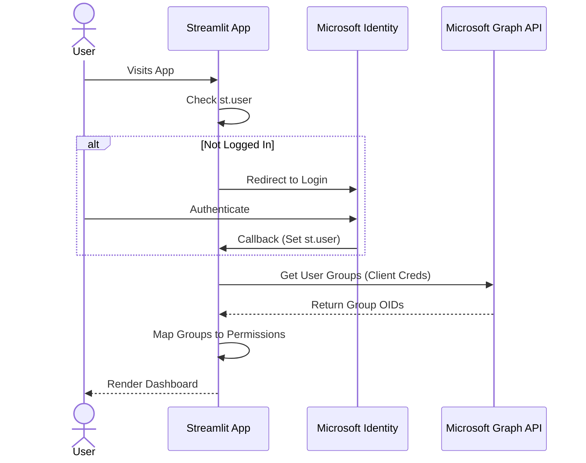
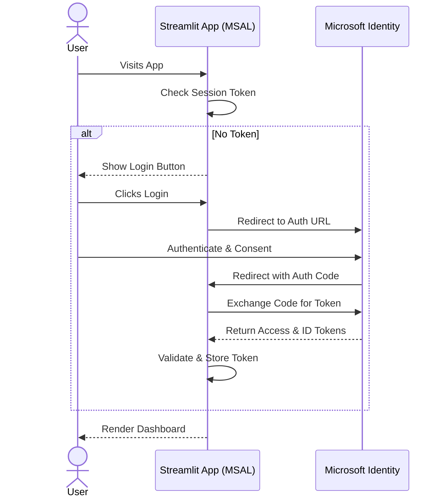

# Authentication & Authorization

This document outlines the authentication and authorization mechanisms used in the Streamlit User Management System.

## Overview

The application uses **Microsoft Entra ID (formerly Azure AD)** for authentication. It supports two modes:
1.  **Streamlit Native Auth (Default)**: Uses Streamlit's built-in OIDC integration.
2.  **MSAL Auth (Optional)**: Uses the Microsoft Authentication Library (MSAL) for Python for more control over the token flow.

Authorization is Role-Based (RBAC), mapping Entra ID Groups to application permissions.

## 1. Streamlit Native Authentication (Default)

This flow relies on Streamlit's native integration with identity providers.

### Configuration
Configured in `.streamlit/secrets.toml`:
```toml
[auth]
redirect_uri = "http://localhost:8501/oauth2callback"
cookie_secret = "..."
client_id = "..."
client_secret = "..."
server_metadata_url = "https://login.microsoftonline.com/{tenant_id}/v2.0/.well-known/openid-configuration"
```

### Flow
1.  **User Access**: User visits the app.
2.  **Auth Check**: `AuthGuard` checks `st.user` (populated by Streamlit after successful login).
3.  **Redirect**: If not logged in, `st.login()` redirects to Microsoft Login.
4.  **Callback**: Microsoft redirects back to the app.
5.  **Session**: Streamlit sets the user session in `st.user`.
6.  **Permission Sync**:
    -   `AuthGuard` extracts the user's Object ID (OID) from `st.user`.
    -   It calls Microsoft Graph API (using Client Credentials) to fetch the user's group memberships.
    -   Groups are mapped to permissions (`VIEWER`, `ANALYST`, `ADMIN`) based on `secrets.toml`.



## 2. MSAL Authentication (Optional)

This flow uses `msal` to handle the OAuth2 Authorization Code Flow manually. This is useful if you need more control over tokens or if Streamlit's native auth is insufficient (e.g., for complex claim handling).

### Usage
To use this, replace `AuthGuard` with `MSALAuthGuard` in `streamlit_main.py`.

### Flow
1.  **User Access**: User visits the app.
2.  **Auth Check**: `MSALAuthGuard` checks `st.session_state` for a valid token.
3.  **Login URL**: If not logged in, it generates a login URL using `msal.ConfidentialClientApplication.get_authorization_request_url`.
4.  **Redirect**: User clicks "Login" and is redirected to Microsoft.
5.  **Callback**:
    -   Microsoft redirects to the app with an authorization `code`.
    -   App captures the code (via query params).
    -   `MSALAuthGuard` exchanges the code for an Access Token and ID Token using `acquire_token_by_authorization_code`.
6.  **Validation**: ID Token claims are validated.
7.  **Session**: User info is stored in `st.session_state`.



## Authorization (RBAC)

Permissions are determined by mapping Entra ID Groups to Application Roles.

### Roles
-   **VIEWER**: Read-only access to basic dashboards.
-   **ANALYST**: Access to detailed reports and FinOps chat.
-   **ADMIN**: Full access, including Admin Dashboard and Logs.

### Group Mapping
Mappings are defined in `secrets.toml`:
```toml
[group_mappings]
"group-oid-1" = "VIEWER"
"group-oid-2" = "ADMIN"
```

> [!IMPORTANT]
> **Entra ID Token Limits & "Overage"**
>
> Entra ID has limits on the number of groups emitted in a token:
> -   **JWT**: Max 200 groups.
> -   **SAML**: Max 150 groups.
> -   **Implicit Flow**: Max 6 groups.
>
> If a user belongs to more groups than the limit, Entra ID omits the `groups` claim and sends an **overage claim** (`_claim_names` and `_claim_sources`) instead.
>
> **Our Solution**:
> To ensure reliability regardless of user group count, this application **always** fetches group memberships directly from the **Microsoft Graph API** (`/users/{oid}/memberOf`) using the application's Client Credentials. This bypasses the token limits entirely and ensures we get the complete list of groups.

### Debugging
-   **Admin Dashboard**: Users with `ADMIN` role can view the "Admin Dashboard" to see raw token claims and group memberships.
-   **Logs**: Auth events are logged to the console and visible in the Admin Dashboard.
