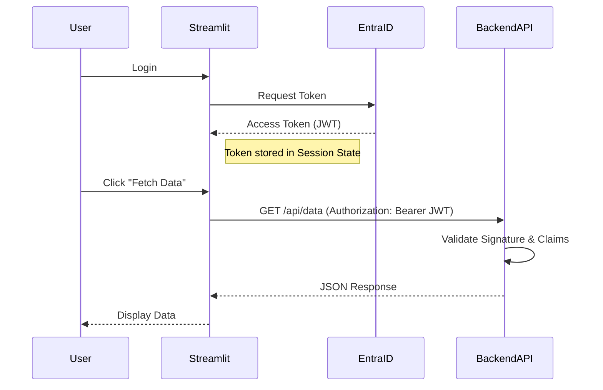

# JWT Authentication & Backend Integration

This document describes the JSON Web Token (JWT) flow used in the application and how to use the token to authenticate requests to backend APIs.

## JWT Flow Overview

When using the **MSAL Authentication** flow (`MSALAuthGuard`), the application acquires a JWT Access Token from Microsoft Entra ID.

1.  **User Login**: User clicks "Sign in with Microsoft".
2.  **Authorization**: User consents to permissions.
3.  **Token Acquisition**: The application exchanges the authorization code for an **Access Token** (JWT) and **ID Token**.
4.  **Storage**: The Access Token is stored in `st.session_state["access_token"]`.



## Token Structure

The Access Token is a Base64-encoded JSON object containing **Claims**.

### Example Decoded Payload
```json
{
  "aud": "api://your-client-id",
  "iss": "https://sts.windows.net/your-tenant-id/",
  "iat": 1699999999,
  "nbf": 1699999999,
  "exp": 1700003599,
  "name": "John Doe",
  "oid": "12345678-1234-1234-1234-123456789abc",
  "preferred_username": "john.doe@example.com",
  "roles": ["Admin"],
  "groups": ["group-oid-1", "group-oid-2"],
  "tid": "your-tenant-id",
  "ver": "1.0"
}
```

### Key Claims
-   **`oid`**: Object ID (User's unique identifier).
-   **`groups`**: List of Group Object IDs the user belongs to (requires configuration in Entra ID).
-   **`roles`**: Application roles assigned to the user.
-   **`exp`**: Expiration timestamp.

## Using the Token with Backend APIs

To access a protected backend API from Streamlit, you must pass the Access Token in the `Authorization` header.

### Streamlit Client Example (Python)

```python
import streamlit as st
import requests

def call_backend_api(endpoint: str, data: dict = None):
    """
    Call a protected backend API using the current user's token.
    """
    # 1. Retrieve the token from session state
    token = st.session_state.get("access_token")
    
    if not token:
        st.error("No access token found. Please log in.")
        return None
        
    # 2. Set up the Authorization header
    headers = {
        "Authorization": f"Bearer {token}",
        "Content-Type": "application/json"
    }
    
    api_url = f"https://api.your-backend.com/v1/{endpoint}"
    
    try:
        # 3. Make the request
        if data:
            response = requests.post(api_url, json=data, headers=headers)
        else:
            response = requests.get(api_url, headers=headers)
            
        # 4. Handle response
        if response.status_code == 401:
            st.error("Session expired. Please re-authenticate.")
            # Optional: Trigger logout/refresh
            return None
            
        response.raise_for_status()
        return response.json()
        
    except requests.exceptions.RequestException as e:
        st.error(f"API Call failed: {e}")
        return None

# Usage in Streamlit App
if st.button("Fetch Sensitive Data"):
    data = call_backend_api("financial-reports")
    if data:
        st.json(data)
```

### Backend Validation Example (FastAPI)

The backend must validate the JWT signature and claims.

```python
from fastapi import FastAPI, Depends, HTTPException, status
from fastapi.security import OAuth2PasswordBearer
from jose import jwt, JWTError

app = FastAPI()

# Define the scheme
oauth2_scheme = OAuth2PasswordBearer(tokenUrl="token")

# Configuration
TENANT_ID = "your-tenant-id"
CLIENT_ID = "your-client-id"
# Microsoft's public keys URL
JWKS_URL = f"https://login.microsoftonline.com/{TENANT_ID}/discovery/v2.0/keys"

def validate_token(token: str = Depends(oauth2_scheme)):
    """
    Validate the JWT token against Microsoft's JWKS.
    """
    try:
        # In a real app, you would fetch and cache the JWKS keys
        # and verify the signature using a library like python-jose or PyJWT.
        # You also need to validate 'aud' (Audience) and 'iss' (Issuer).
        
        # Mock validation for example purposes
        payload = jwt.get_unverified_claims(token) # DO NOT USE IN PRODUCTION without signature verification
        
        if payload.get("aud") != CLIENT_ID:
             raise HTTPException(status_code=401, detail="Invalid audience")
             
        return payload
        
    except JWTError:
        raise HTTPException(
            status_code=status.HTTP_401_UNAUTHORIZED,
            detail="Could not validate credentials",
            headers={"WWW-Authenticate": "Bearer"},
        )

@app.get("/financial-reports")
async def get_reports(current_user: dict = Depends(validate_token)):
    # Check permissions based on claims
    if "Admin" not in current_user.get("roles", []):
         raise HTTPException(status_code=403, detail="Insufficient permissions")
         
    return {
        "user": current_user.get("name"),
        "data": ["Report A", "Report B"]
    }
```

## Security Best Practices

> [!IMPORTANT]
> **HTTPS**: Always use HTTPS to protect the token in transit.

> [!WARNING]
> **Token Storage**: In Streamlit, `st.session_state` is server-side (in memory), which is generally safe for the session duration. **Do not store tokens in `st.query_params` or client-side cookies without encryption.**

> [!CAUTION]
> **Validation**: The backend **MUST** validate the signature, expiration (`exp`), issuer (`iss`), and audience (`aud`) of the token. Never trust a token without verification.

> [!TIP]
> **Scope**: Ensure the token has the correct scopes (e.g., `api://your-api/.default`) to access the backend.
