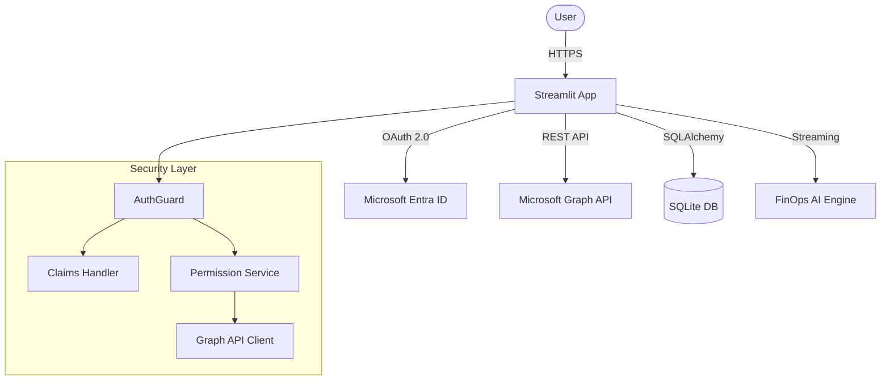

# FinOps AI Dashboard

A modern cloud cost intelligence platform built with **Streamlit 1.52+**, featuring **Microsoft Entra ID authentication**, **role-based access control**, and an **AI-powered FinOps assistant**.

---

## Project Structure

```
finops-ai-dashboard/
│
├── src/
│   ├── auth/                     # Authentication module (Entra ID)
│   │   ├── __init__.py           # Module exports
│   │   ├── claims.py             # User claims extraction and validation
│   │   ├── config.py             # Auth configuration and permission levels
│   │   ├── external.py           # External auth utilities
│   │   ├── graph_client.py       # Microsoft Graph API client
│   │   ├── guard.py              # Main authentication guard
│   │   ├── logging.py            # Authentication event logging
│   │   ├── msal_guard.py         # Legacy MSAL auth (deprecated)
│   │   └── permissions.py        # Permission service and level management
│   │
│   ├── database/                 # Database layer
│   │   ├── __init__.py
│   │   ├── database.py           # SQLite connection and setup
│   │   └── models.py             # SQLAlchemy models
│   │
│   ├── finops/                   # FinOps AI engine
│   │   ├── data.py               # Mock AWS cost data generator
│   │   └── engine.py             # AI assistant with streaming responses
│   │
│   ├── ui/                       # Streamlit UI components
│   │   ├── __init__.py
│   │   ├── admin.py              # Admin dashboard (user info, logs)
│   │   ├── chat.py               # AI chat interface
│   │   ├── components.py         # Reusable UI components
│   │   ├── dashboard.py          # Cost analytics dashboard
│   │   ├── managers.py           # Session and state management
│   │   ├── pages.py              # Application routing
│   │   ├── services.py           # Backend services
│   │   └── styles.py             # Custom CSS theming
│   │
│   └── settings.py               # Environment configuration
│
├── tests/                        # Test suite
│   ├── test_auth_claims.py       # Property-based tests for claims
│   ├── test_auth_config.py       # Auth config tests
│   ├── test_graph_client.py      # Graph API client tests
│   ├── test_e2e.py               # End-to-end tests
│   └── test_e2e_mock.py          # E2E tests with mocks
│
├── .streamlit/
│   ├── config.toml               # Streamlit configuration
│   ├── secrets.toml              # Auth secrets (not committed)
│   └── secrets.toml.example      # Example secrets template
│
├── main.py                       # Application entry point
├── streamlit_main.py             # Alternative entry point
├── pyproject.toml                # Python dependencies (uv/pip)
└── README.md                     # This file
```

---

## Features

### Core Functionality
- **Cloud Cost Dashboard** - Interactive visualizations with Plotly (trend analysis, service distribution, regional heatmaps)
- **FinOps AI Assistant** - Streaming chat interface with "thinking" indicators and response metrics
- **Admin Dashboard** - User info, Entra ID metrics, authentication logs, and enhanced JWT token display

### Authentication & Security
- **Microsoft Entra ID** - Enterprise SSO using Streamlit's native OIDC (`st.login`, `st.logout`, `st.user`)
- **Role-Based Access Control** - Three permission tiers: VIEWER, ANALYST, ADMIN
- **Microsoft Graph API** - Retrieves group memberships for permission mapping
- **JWT Token Management** - Automatic expiration handling and session management
- **Enhanced JWT Visualization** - User-friendly JWT token display with detailed claims breakdown and documentation
- **Event Logging** - Tracks auth events, failures, and access attempts

### Technical Stack
- **Streamlit 1.52+** - Modern features: `st.popover`, `st.badge`, `st.segmented_control`, `st.fragment`
- **Plotly** - Interactive charts and visualizations
- **SQLAlchemy** - Database ORM with SQLite
- **Hypothesis** - Property-based testing framework
- **HTTPX** - Async HTTP client for Graph API

---

## Architecture



---

## Installation

### Prerequisites
- Python 3.11+
- [uv](https://docs.astral.sh/uv/) (recommended) or pip

### Setup

1. **Clone the repository**
```bash
git clone https://github.com/mariusciurea/streamlit_user_management.git
cd streamlit_user_management
```

2. **Create virtual environment and install dependencies**
```bash
# Using uv (recommended)
uv sync

# Or using pip
python -m venv .venv
source .venv/bin/activate  # Linux/Mac
pip install -e .
```

3. **Configure environment**
```bash
cp src/example.env .env
cp .streamlit/secrets.toml.example .streamlit/secrets.toml
```

4. **Configure Entra ID** (see [Authentication Setup](#authentication-setup))

---

## Running the App

```bash
# Using uv
uv run streamlit run streamlit_main.py

# Or directly
streamlit run streamlit_main.py
```

The app will be available at `http://localhost:8501`.

---

## Running Tests

```bash
# Run all tests
uv run pytest tests/

# Run with verbose output
uv run pytest tests/ -v

# Run specific test file
uv run pytest tests/test_auth_claims.py
```

The test suite includes:
- **Property-based tests** using Hypothesis for claims extraction, login status, and token expiration
- **Unit tests** for auth configuration and Graph API client
- **E2E tests** for full application flows

---

## Authentication Setup

This application uses **Microsoft Entra ID** for enterprise authentication.

<details>
<summary><b>Click to expand configuration steps</b></summary>

### 1. Register Application in Entra ID

1. Go to [Azure Portal](https://portal.azure.com) → **Microsoft Entra ID** → **App registrations**
2. Click **New registration**
3. Configure:
   - Name: "FinOps AI Dashboard"
   - Supported account types: **Single tenant**
   - Redirect URI: `http://localhost:8501/oauth2callback` (Web)
4. Note the **Application (client) ID** and **Directory (tenant) ID**

### 2. Create Client Secret

1. Go to **Certificates & secrets** → **New client secret**
2. Copy the secret **Value** immediately (shown only once)

### 3. Configure API Permissions

1. Go to **API permissions** → **Add a permission** → **Microsoft Graph**
2. Add delegated permissions:
   - `User.Read`
   - `GroupMember.Read.All`
3. Click **Grant admin consent**

### 4. Get Group Object IDs

1. Go to **Microsoft Entra ID** → **Groups**
2. Copy the **Object ID** for each group you want to map to permissions

### 5. Configure secrets.toml

```toml
[auth]
client_id = "your-application-client-id"
client_secret = "your-client-secret-value"
tenant_id = "your-directory-tenant-id"
redirect_uri = "http://localhost:8501/"
cookie_secret = "your-strong-random-secret-at-least-32-chars"
server_metadata_url = "https://login.microsoftonline.com/{tenant_id}/v2.0/.well-known/openid-configuration"

[auth.group_mappings]
"admin-group-oid" = "admin"
"analyst-group-oid" = "analyst"
"viewer-group-oid" = "viewer"
```

</details>

### Permission Levels

| Level | Value | Access |
|-------|-------|--------|
| VIEWER | 1 | Read-only access to chat assistant |
| ANALYST | 2 | Dashboard access + data analysis |
| ADMIN | 3 | Full access including admin dashboard |

---

## Development

### Admin Dashboard & JWT Visualization

The Admin Dashboard includes an enhanced JWT token display with three distinct views:

1. **Claims Viewer** (`🔍`) - Raw JSON display for technical inspection
2. **Claims Summary** (`📋`) - Organized, user-friendly breakdown of token data
   - User Information: Name, email, username, Object ID
   - Organization Info: Tenant ID, issuer, audience, and expiration status
   - Additional Claims: Groups, roles, and other attributes with smart formatting
3. **Claims Guide** (`ℹ️`) - Comprehensive documentation explaining each JWT claim type

**Key Features:**
- Automatic expiration checking with visual indicators (✅ Valid / ❌ Expired)
- Smart array handling for groups and roles
- Readable timestamp conversion from Unix format
- Detailed documentation table for understanding JWT standards

### Project Dependencies

Managed via `pyproject.toml`:

**Runtime:**
- streamlit >= 1.52.1
- authlib, msal (authentication)
- httpx (async HTTP)
- pandas, numpy, plotly (data/viz)
- sqlalchemy (database)
- python-jose (JWT)
- uvloop (event loop)
- orjson (performance)
- watchdog (file watching)

**Dev:**
- pytest
- hypothesis (property-based testing)
- pytest-asyncio

### Environment Variables

| Variable | Description | Default |
|----------|-------------|---------|
| `NO_AUTH` | Skip auth for local dev | - |
| `DEBUG` | Enable debug mode | `False` |
| `DB_HOST` | Database host | `localhost` |
| `JWT_SECRET_KEY` | JWT signing key | (change in prod) |

---

## Troubleshooting

<details>
<summary><b>Common Issues</b></summary>

**"Redirect URI mismatch"**
- Ensure `redirect_uri` in secrets.toml matches Entra ID exactly (including trailing slash)

**"Insufficient permissions"**
- Verify admin consent was granted for Graph API permissions

**User gets VIEWER unexpectedly**
- Check group OIDs in secrets.toml match Azure Portal
- Verify user is a member of the expected groups

**Token expiration**
- Tokens expire after 30 days by default
- Users are automatically prompted to re-authenticate

**JWT Display Issues**
- Enhanced JWT visualization available in Admin Dashboard
- Use the Claims Summary tab for user-friendly token information
- Check expiration status in the Organization Info section
- For technical details, use the Claims Viewer tab to see raw JSON

</details>

---

## License

MIT
