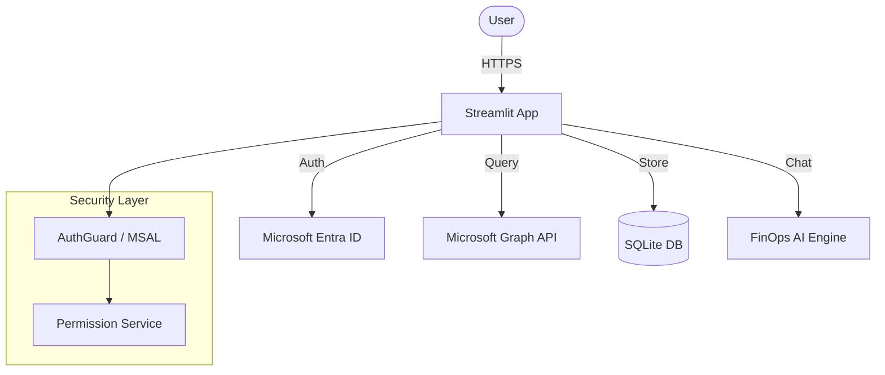

# Streamlit User Management System (BHP FinOps Edition)

This is a modular and scalable user management system built with **Streamlit**, customized with a **BHP-inspired theme** and a **modern FinOps Chatbot**. It supports **user registration**, **login with JWT authentication**, and a **dashboard interface** with an intelligent chatbot.

---

## Project Structure
```
streamlit_user_management/
│
├── src/
│   ├── database/
│   │   ├── __init__.py
│   │   ├── database.py       # Database connection and setup
│   │   └── models.py         # SQLAlchemy models
│   │
│   ├── ui/
│   │   ├── __init__.py
│   │   ├── components.py     # Reusable UI components
│   │   ├── managers.py       # Authentication and session logic
│   │   ├── pages.py          # Login, register, and dashboard pages
│   │   ├── admin.py          # Admin Dashboard component
│   │   ├── chat.py           # Chatbot interface logic
│   │   ├── styles.py         # Custom CSS for BHP theme
│   │   └── services.py       # Backend services used by the UI
│   │
│   ├── finops/
│   │   ├── engine.py         # FinOps chatbot logic
│   │   └── data.py           # Mock data for chatbot
│   │
│   ├── settings.py           # Environment configuration and constants
│   ├── .env                  # Actual environment variables (not committed)
│   ├── example.env           # Example .env file
│   
├── tests/                    # End-to-End tests
├── streamlit_main.py         # Entry point for the Streamlit app
├── requirements.txt          # Required Python packages
├── .gitignore                # Git ignored files
└── README.md                 # Project documentation
```

---

## Features

- ✅ **BHP Themed UI**: Modern, clean interface with BHP Orange branding.
- ✅ **FinOps Chatbot**: Intelligent assistant with streaming responses and "thinking" indicators.
- ✅ **Admin Dashboard**: View user access, group memberships, and authentication logs.
- ✅ **Microsoft Entra ID Authentication**: Enterprise SSO with group-based permissions (Native & MSAL).
- ✅ **Role-Based Access Control**: Map Entra ID groups to application permission levels.
- ✅ **SQLite Database**: Zero-config local development database.

## Architecture



> [!NOTE]
> This project uses **Streamlit 1.51+** features like `st.popover`, `st.pills`, and `st.feedback`.


---

## 🔧 Installation & Setup

1. **Clone the repository**

```bash
git clone https://github.com/mariusciurea/streamlit_user_management.git
cd streamlit_user_management
```

2. **Create a virtual environment**
```bash
python -m venv .venv
source .venv/bin/activate  # Linux/Mac
# .venv\Scripts\activate   # Windows
```

3. **Install dependencies**

```bash
pip install -r requirements.txt
pip install pytest playwright
playwright install chromium
```

4. **Set up environment variables**

Create a `.env` file based on `example.env`:

```bash
cp example.env .env
```

5. **Configure Entra ID Authentication**

See the [Authentication Setup](#authentication-setup) section below for detailed instructions.

## Running the App

Start the Streamlit app with:

```bash
streamlit run streamlit_main.py
```

The app will be available at `http://localhost:8501`.

## Running Tests

To run the end-to-end tests:

```bash
pytest tests/
```

---

## Authentication Setup

## Authentication Setup

This application uses **Microsoft Entra ID (Azure AD)** for enterprise authentication with role-based access control.

<details>
<summary><b>Click to expand detailed configuration steps</b></summary>

### 1. Register an Application in Entra ID

1. **Navigate to Azure Portal**
   - Go to [Azure Portal](https://portal.azure.com)
   - Navigate to **Microsoft Entra ID** (formerly Azure Active Directory)

2. **Create App Registration**
   - Click **App registrations** → **New registration**
   - Enter application name (e.g., "FinOps AI Dashboard")
   - Select **Accounts in this organizational directory only (Single tenant)**
   - Set **Redirect URI**:
     - Platform: **Web**
     - URI: `http://localhost:8501/oauth2callback` (for local development)
     - For production, use your deployed URL (e.g., `https://your-app.com/oauth2callback`)
   - Click **Register**

3. **Note Your Application IDs**
   - Copy the **Application (client) ID** - you'll need this for `client_id`
   - Copy the **Directory (tenant) ID** - you'll need this for `tenant_id`

4. **Create Client Secret**
   - Go to **Certificates & secrets** → **Client secrets** → **New client secret**
   - Add a description (e.g., "FinOps Dashboard Secret")
   - Select expiration period (recommended: 24 months)
   - Click **Add**
   - **IMPORTANT**: Copy the secret **Value** immediately - you'll need this for `client_secret`
   - You won't be able to see it again!

5. **Configure API Permissions**
   - Go to **API permissions** → **Add a permission**
   - Select **Microsoft Graph** → **Delegated permissions**
   - Add these permissions:
     - `User.Read` - Read user profile
     - `GroupMember.Read.All` - Read group memberships
   - Click **Add permissions**
   - Click **Grant admin consent** (requires admin privileges)

6. **Configure Token Claims (Optional)**
   - Go to **Token configuration** → **Add optional claim**
   - Select **ID** token type
   - Add claims: `email`, `preferred_username`
   - Click **Add**

### 2. Get Group Object IDs

To map Entra ID groups to application permissions, you need the Object IDs (OIDs) of your groups:

1. **Navigate to Groups**
   - In Azure Portal, go to **Microsoft Entra ID** → **Groups**

2. **Find Your Groups**
   - Locate the groups you want to use for permissions (e.g., "FinOps Admins", "FinOps Analysts", "FinOps Viewers")
   - Click on each group

3. **Copy Object IDs**
   - On the group's **Overview** page, copy the **Object ID**
   - This is a GUID like `12345678-1234-1234-1234-123456789abc`
   - Repeat for all groups you want to map

### 3. Configure secrets.toml

Create or update `.streamlit/secrets.toml` with your Entra ID configuration:

```toml
[auth]
# Application credentials from Entra ID app registration
client_id = "your-application-client-id"
client_secret = "your-client-secret-value"
tenant_id = "your-directory-tenant-id"

# Redirect URI (must match what you configured in Entra ID)
redirect_uri = "http://localhost:8501/oauth2callback"

# Cookie secret for session management (generate a strong random string)
cookie_secret = "your-strong-random-secret-at-least-32-chars"

# OIDC metadata URL (automatically constructed from tenant_id)
server_metadata_url = "https://login.microsoftonline.com/{tenant_id}/v2.0/.well-known/openid-configuration"

# Group-to-permission mappings
[auth.group_mappings]
"12345678-1234-1234-1234-123456789abc" = "admin"    # Replace with your admin group OID
"23456789-2345-2345-2345-234567890abc" = "analyst"  # Replace with your analyst group OID
"34567890-3456-3456-3456-345678901abc" = "viewer"   # Replace with your viewer group OID
```

> [!WARNING]
> **NEVER commit secrets.toml to version control**. It contains sensitive credentials.

### 4. Group-to-Permission Mapping

The application supports three permission levels:

| Permission Level | Value | Description |
|-----------------|-------|-------------|
| **VIEWER** | 1 | Read-only access to dashboards and reports |
| **ANALYST** | 2 | View and analyze data, run queries |
| **ADMIN** | 3 | Full access including configuration and user management |

</details>

### Troubleshooting

<details>
<summary><b>Common Issues & Fixes</b></summary>

**"Redirect URI mismatch" error:**
- Ensure the `redirect_uri` in `secrets.toml` exactly matches what's configured in Entra ID
- Check for trailing slashes and http vs https

**"Insufficient permissions" error:**
- Verify admin consent was granted for Microsoft Graph API permissions
- Check that `GroupMember.Read.All` permission is present

**User gets VIEWER permission unexpectedly:**
- Verify the user is actually a member of the expected groups in Entra ID
- Check that group OIDs in `secrets.toml` are correct (copy-paste from Azure Portal)
- Ensure group OIDs are strings in quotes

**Token expiration issues:**
- Tokens expire after 30 days by default
- Users will be automatically logged out and prompted to re-authenticate
- This is normal behavior for security

</details>

---

## Scalability

This app is designed with modularity and scalability in mind. After the user logs in, they are redirected to a dashboard page. 
This dashboard can easily be extended with custom widgets or components, making it ideal for admin panels, analytics apps, 
or any Streamlit-based UI that requires user authentication.
