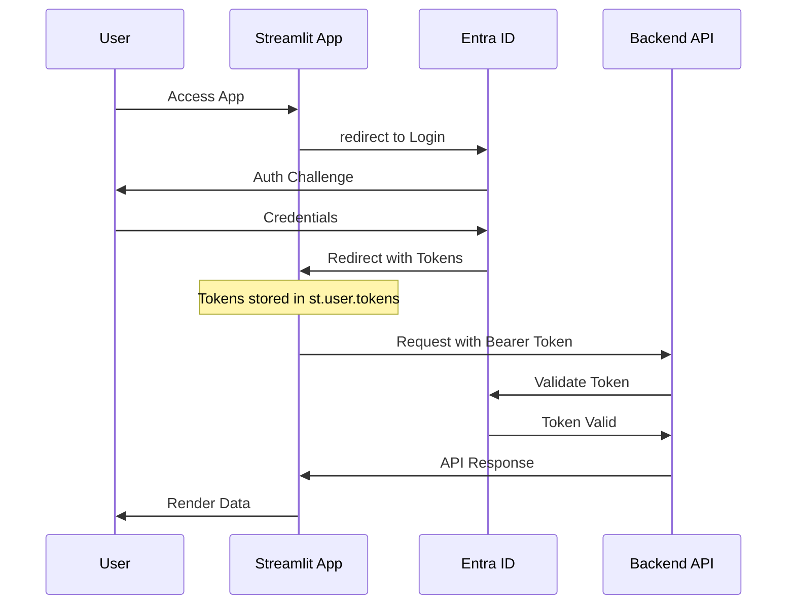

# Token Management & Downstream API Integration

This guide explains how to leverage the latest authentication features in **Streamlit Nightly** to securely handle OIDC tokens and reuse them for calls to downstream backend services.

---

## 🛠️ Configuration

To access raw tokens within your Streamlit application, you must explicitly enable token exposure in your `.streamlit/secrets.toml` file.

> [!CAUTION]
> Exposing tokens introduces security risks. Only enable this feature if your application needs to act on behalf of the user when calling external APIs.

```toml
[auth]
client_id = "your-client-id"
client_secret = "your-client-secret"
# ... other auth settings ...

# Enable token exposure (New in Nightly)
expose_tokens = ["id", "access"]
```

---

## 🔄 Token Flow Architecture

The following diagram illustrates how tokens are acquired from Entra ID and forwarded to a downstream backend service.



---

## 🚀 Usage in Code

### 1. Retrieving Tokens
You can access tokens directly via the `st.user.tokens` object.

```python
import streamlit as st

if st.user.is_logged_in:
    access_token = st.user.tokens.get("access")
    id_token = st.user.tokens.get("id")
    
    if access_token:
        st.success("Access Token available for downstream calls")
```

### 2. Calling a Downstream API
The `src/auth/external.py` module provides a helper to create an authenticated `httpx` client.

```python
from src.auth.external import get_authenticated_client

# Get a client pre-configured with the user's Bearer token
client = get_authenticated_client(base_url="https://api.finops-backend.local")

response = client.get("/v1/costs/detailed")
data = response.json()
```

---

## 🔄 Token Refresh Mechanism

Identity and Access tokens have a limited lifespan (usually 1 hour). Streamlit Nightly provides two ways to ensure your tokens remain valid:

### Adaptive Refresh
The "Refresh Access Token" button in the **Admin Console** uses `st.login()` to re-trigger the OIDC flow. Since the user usually has an active browser session with Entra ID, this is often a seamless background redirect.

> [!TIP]
> Use `st.login()` programmatically if you detect an `Unauthorized (401)` response from your downstream API.

```python
if response.status_code == 401:
    st.toast("Session expired. Refreshing...", icon="🔄")
    st.login()
```

---

## 🛡️ Security Best Practices

> [!WARNING]
> **Never** display raw tokens in the UI for regular users. Only expose them in the Admin Console or for debugging purposes with strict access controls.

1. **Short Lifespans**: Keep token durations short on the Entra ID side.
2. **Minimal Scopes**: Only request the scopes necessary for your downstream API.
3. **Audience Validation**: Ensure your backend API validates the `aud` (audience) claim to prevent token replay attacks.
4. **HTTPS Always**: Never transmit tokens over unencrypted channels.

---

> [!TIP]
> For more information on the base authentication setup, refer to [AUTH.md](AUTH.md).
